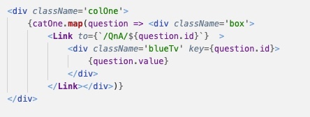

## Project 3: JEVpardy App

This is a project utilizing React interaction with HTML, CSS, Javascript and GitHub collaboration. We created an app that plays Jepardy questions and is deployed using Surge.

### Project Links
[Here is the project repository.](https://github.com/countryraised/JEVpardy)

[Here is the published project.](http://jevpardy.surge.sh/)

#### Entity Relationship Diagram

### Current Features
* Welcoming the user
* Shows 25 questions based on 5 catagories with increasing difficulty
* Answers respond on a timer
* Records the score positive or negative
* Returns player to gameboard
* Surprise SNL guest "Turd Ferguson"

### Planned Features
* Randomize questions
* Add players so up to 3 can participate
* Extra CSS styling and pop ups

### Technology Used
* Utilizing React architecture
  * Router
  * Links
  * Redirect
* Axios
* Surge

### Example Code

### Issues and Resolutions
With three people working on this project we had to figure out how to all work in our own branches without creating errors when merging materials. While we decided to all work in our own branch we still faced some issues with not having the correct amounts of commits or not using the correct commands in Github.  Needless to say we all could use some extra Github experience under our belts.

Deployment using Surge was painless and Heroku should take note. We had one member what had to delete his project and pull fresh material down as we could not get Github corrected.

### Additional Comments
We all discussed a style to keep our code consistent while creating seperate CSS files to target our own pages, etc.

### User Stories
##### Story 1
As a family I want to have a game night and enjoy some Jepardy questions with family.
##### Story 2
I want to be able to play the JEVpardy game against my friends and come out on top.
##### Story 3
My wife wants to practice JEVpardy for a possible future Jepardy appearance.
##### Story 4
My kids want to learn about all the past boomer experiences in history.
##### Story 5
I want to play a 3 player game and invite Turd Ferguson to see if he is as bad as he was on SNL.
